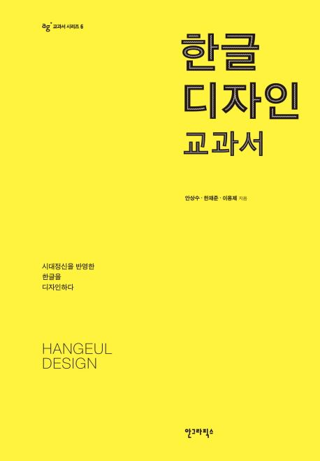

<h1>한글 디자인 교과서</h1>

<h2>1. 세계의 글자와 한글</h2>
<h3>1-1. 글자의 기능</h3>
<li>글자는 정보(언어, 소리)를 기록하는 기능을 가진다. 기록 기능은 정보를 보관(저장)할 수도 있고, 보관함으로써 전달할 수 있다.</li>
<li>글자는 예술 표현의 좋은 대상이 될 수 있다. 글자의 기능을 살펴봄으로써 한글 디자인의 방향을 설정할 수 있다.</li> 
<li>저장 기능</li>
<li>전달 기능</li>
<li>예술 기능</li>

<h3>1-2. 글자의 기원</h3>
<li>세계에는 다양한 글자가 있고 그 글자 중에는 여러 글자의 기원이 되거나 큰 영향을 준 글자들이 있다.</li>
<li>각 글자들은 그 글자가 속한 갈래의 뿌리에 해당하는 글자의 원형적 특징들을 담고있다.</li>
<li>초기 글자 가운데 수메르 글자, 이집트 글자, 중국의 한자는 단기간에 소멸되지 않고 지금까지 남아 여러 글자들의 발달에 영향을 주었다.</li>
<li>이 점이 글자 발전사의 세 갈래 뿌리라 할 수 있다.</li>

<h3>1-3. 글자의 발전 단계</h3>
<li>글자 하나가 말의 어떤 단위를 대표하느냐에 따라 글자를 아래와 같이 4가지로 분류한다.</li>
<li>낱소리글자는 자모글자, 낱말글자는 뜻글자라고도 한다.</li>
<li>소리마디글자, 낱소리글자는 각 글자가 대표하는 단위가 소리단위이기 때문에 소리글자라고 부른다.</li>
<li>그림글자</li>
<li>낱말글자</li>
<li>소리마디글자: 글자 하나하나가 언어 단위 중에서 소리마디를 나타내는 글자이다.</li>
<li>낱소리글자: 글자 하나하나가 낱소리, 곧 닿소리와 홀소리를 따로 나누어 나타내는 글자이다.</li>

<h3>1-4. 필기도구와 글자꼴</h3>
<li>첨필과 진흙판</li>
<li>갈대펜과 파피루스</li>
<li>끌과 돌</li>
<li>깃촉펜과 양피지</li>
<li>종이와 붓</li>

<h2>2. 한글 창제와 한글꼴의 발달</h2>
<h3>2-1. 한글 창제 배경</h3>
<li>한글 창제의 동기: 백성들이 쉽게 글자 생활을 하도록 만들려는 의도가 있었다.</li>
<li>한글의 철학적 배경: 글자란 우주의 비밀을 풀고자 하는 인간의 발명품이다. 하여 단순한 형태에 가두어 그대로 반영해야 한다.</li>
<li>한글 최소 형태소: 한글 형태 구조를 분해하면 세로줄기, 가로줄기, 빗금, 동그라미 이상 네 가지가 된다.(교재 p.60 그림 참고)</li>
<li>한글의 조형적 배경: 한글은 공간을 수직, 수평으로 분절하여 그것을 글자소로 한 글자이다. 따라서 방향을 바꾸어 놓으면 다른 글자로 바뀌게 되는 경우가 많다.</li>
<li>한글의 음운학적 배경: 우리말을 세 조각(초성, 중성, 종성)으로 나누는 새로운 이론을 세우고 이에 따라 글자를 창제했다.</li> 

<h3>2-2. 한글의 글자 특성</h3>
<li>자음 = 자음자 = 닿소리 글자 = 닿자</li>
<li>모음 = 모음자 = 홀소리 글자 = 홀자</li>
<li>낱소리 글자: 한글은 낱글자를 조립해 소리마디글자화를 만드는 특성이 있다. 세계에서 유일한 한 글자 한 소리의 낱소리 글자이다.</li>
<li>단순하고 정교한 글자: 한글에서 사용하는 낱자는 닿자 14자와 10자로 세계에서 가장 간단한 글자 체계 중 하나이다.</li>
<li>소리(성격, 변화)에 따라 변하는 글자: 기본형을 시작으로 소리의 변화에 따른 가획은 소리의 근본을 알 수 있게 한다. 자질 글자라고 한다.</li>

<h3>2-3 한글의 조형적 특징</h3>
<li>조형: 형태를 이루어 만드는 것, 형상을 만드는 것</li>
<li>모아쓰기(조합) 글자</li>
<li>간결한 형태 체계의 글자: 창제 당시 한글꼴은 단순 간결한 직선과 사선, 정원, 직각 등의 기하학적 형태를 지니고 있었다.</li>
<li>자연을 본뜬 글자: 발성 기관을 본뜬 닿자, 하늘과 땅과 사람을 추상화한 홀자</li>

<h3>2-4. 한글꼴의 발달</h3>
<li>한글은 인쇄된 글자가 손멋글씨보다 먼저 만들어지는 독특한 출발을 한 글자이다.</li>
<li>창제 당시 한글꼴: 창제 때의 한글꼴은 붓으로 쓰기에는 쉽지 않은 단순, 간결한 기하학적 형태를 보여준다.</li>
<li>옛활자: 창제 이후 한글 활자꼴은 단종 때의 '홍무정운역훈'의 활자에서 쓰기글씨의 영향으로 변화의 조짐을 보여주고 이는 실용화되면서 점차로 쓰기글자의 형태가 이루어지는 과정으로 변화한다.</li>
<li>새활자: 한글의 새활자는 1880년 '한불자뎐'에서 시작되는데 납활자 주조 기술의 도입으로 작은 크기의 활자들이 개발되었다.</li>
<li>원도활자: 1945년 815 광복 이후 그동안 한자와 일본의 영향권에 있던 한글꼴은 이번에는 로마자의 영향권으로 빠져들게 되었고 이러한 시대적 배경이 가로쓰기용 한글꼴의 역사가 펼쳐지는 계기가 된다.</li>
<li>디지털활자: 1990년대 이전이 세로짜기 체제의 부산물인 정네모틀의 범위에서 새로운 한글꼴을 모색했던 시기라면 1990년대 이후는 가로쓰기 한글꼴의 정착 단계라 할 수 있다.</li>

<h2>3. 한글 디자인의 기본</h2>
<h3>3-1. 한글 디자인의 개념과 범위</h3>
<li>로고타입처럼 몇몇의 낱글자를 디자인하거나 글자 한 벌 전체를 디자인하는 활자 디자인이 있다.</li>
<li>한글 디자인의 표현 방법은 레터링 개념에서부터 손멋글씨체처럼 쓰는 개념까지 넓어지고 있다.</li>
<li>타이포그래피 : 활자를 뜻하는 'type'과 기록법(서법)이란 뜻인 'graphy'가 합쳐진 것이다. 활자를 디자인하는 것에서부터 활자를 포함한 글자, 기호, 사진, 인쇄와 뉴미디어를 수단으로 삼아 어떤 뜻을 표현하고 전달하는 것에 이른다. 타이포그래피에는 손멋글씨, 레터링, 활자 디자인이 포함된다.</li>
<li>한글 디자인 : 좁은 뜻으로 활자 디자인, 넓은 뜻에서 한글을 디자인하거나 한글로 디자인 하는 것을 말한다. 한글을 구체적인 의미를 전달하는 수단이 아닌 이미지(그림)로서 활용하기 위한 표현이 시도되고있다. </li>

<h3>재료, 도구, 장비</h3>
<li>글자 디자인 도구 : 연필, 지우개, 붓, 종이, 펠트펜, 자, 운형자와 동글원자, 컴퍼스, 커터칼, 펜, 잉크와 물감, 홈자와 우리봉(또는 알미늄봉), 태블릿, 제도판이나 제도 책상, 트레이싱 박스, 돋보기, 계산기, 컴퓨터, 스캐너, 프린터 등</li>
<li>활자 디자인 소프트웨어 : 폰트랩 스튜디오, 아시아폰트 스튜디오, 드리거, 폰토그라퍼, 폰트 스튜디오, 이카루스, 폰트매니아</li>

<h3>3-3. 글자 디자인의 기본</h3>
<li>균형과 조화 : 글자 디자인에서 가장 중요한 것은 '균형을 유지하는 것'으로 이는 시각적인 안정감을 말한다.</li>
<li>그림과 바탕 : 글자는 그림과 바탕의 조화를 이루어야 하며 글자를 지각한다는 것은 형태를 지각하고 의미를 판단하는 과정 전체를 말하며, 그림과 바탕에 따라서 글자의 균형과 조형성이 달라지고 글자의 기능성이 달라진다.</li>
<li>부분과 전체 : 글자의 균형을 취하는 한 가지 방법은 '부분과 전체를 동시에 본다'는 것이다. 전체를 우선 파악하고 가로줄기와 세로줄기 등의 부분 요소끼리의 비례와 꼴, 운필 등과 같은 세부적인 것으로 파고 들어가야 한다.</li>
<li>뼈와 살 : 글자의 뼈대는 글자의 구조를 말하며 점과 줄기의 조합된 모양과 위치 관계를 말한다. 이는 글자꼴의 방향성과 용도를 결정한다. 서체란 그 뼈대 위에 살을 붙여 풍부하게 하여 일정한 규칙으로 표정을 만든 것이다.</li>
<li>시각흐름선 : 글자의 무게 중심은 글자와 글자의 시선을 잇는 연결축이 되고 이것이 시선의 흐름을 만든다. 시선을 편안하게 유도하여 글자들의 흐름이 잘 보일 때 시각흐름선이 있다고 한다. 시각흐름선이란 단순히 글자들이 만들어내는 물리적인 축만 뜻하지 않고 시각적으로 느껴지는 축을 포함한다.</li>
<li>무게 : 글자 무게란 줄기의 굵기 또는 줄기의 많고 적음에 따른 밀도 떄문에 생기는 활자의 무게 느낌을 말한다.</li>
<li>완성도 : 조형적 완성도와 디자인  완성도가 있다.</li>

<h3>3-4. 착시와 시각 보정</h3>
<li>착시 : 글자 디자인에서 크기, 방향, 각도, 곡선 등 평면 도형의 기하학적 형태가 자로 측정된 객관적인 형태와 다르게 보이는 것을 말한다.</li>
<li>시각 보정 : 착시 현상 때문에 글자나 도형이 불균형해 보이거나 조화롭게 보이지 않는 현상을 보완하고 정리하는 과정이다.</li>
<li>크기 : 글자 디자인에서 시각 삭제 현상은 여러 형태로 나타나는데 특히 크기 보정에서는 이러한 개념을 이해하고 시각적인 균형을 유지하도록 한다.</li>
<li>위 아래의 크기</li>
<li>굵기 : 굵기의 변화 요소는 줄기의 각도, 길이, 맺음 부분의 형태 등 다양하므로 주변의 변화에 따라 섬세하게 처리해야 한다.</li>
<li>속공간과 크기 : 글자 크기와 글자 농도를 고르게 하기 위한 비결은 효과적인 공간 처리에 있다.</li>
<li>줄기 수와 글자 크기 : 같은 공간에서 줄기 수가 많으면 글자의 농도가 진해 보이므로 글자의 농도가 일정해 보이도록 하기 위해 줄기의 굵기를 가늘게 처리해야 한다.</li>

<h3>3-5. 활자의 공간</h3>
<li>글자가 놓이는 공간과 그 공간 안에서 글자가 차지하는 면적의 변화는 글자 사이나 낱말 사이에 영향을 준다.</li>
<li>적정한 글줄 사이와 활자의 완성도에 영향을 준다.</li>
<li>유닛과 각 : 유닛은 낱글자의 너비느 글자 사이 등을 짜임새 있게 하기 위한 체계이다.</li>
<li>글자 사이와 낱말 사이 : 활자 디자인에서 위,아래와 양쪽의 여유 공간을 정하는 일은 판면의 표정과 가독성에 큰 영향을 끼치며 활자부리기에 중요한 변화 요소가 된다.</li>
<li>글줄 사이 : 글줄 사이란 용어는 글줄과 글줄 사이의 공간을 가리키는 말이며 포인트로 측정하고 지시한다.</li>

<h2>4. 한글 글자 디자인의 과정</h2>
<h3>4-1. 발상의 샘</h3>
<li>목적과 용도와 환경 등에 따라서 어떠한 한글을 디자인해야 하는지 결정할 수 있다.</li>
<li>발상의 소재 : 역사, 다른 나라 글자, 자연, 예술과 문화, 인간과 환경, 매체와 기술</li>
<li>발상의 방법 : 글자를 보는 사람에 따라 용도를 생각할 수 있고 표현 방법에 따라서도 구체적으로 어떻게 사용할지를 생각하는 것이 발상의 방법이다.</li>
<li>발상의 과정 : 쓰임새를 생각하고 그 용도에 맞는 적합한 글자꼴을 디자인해야 한다.</li>
<li>발상의 발전 : 흥미로운 발상의 소재를 찾았다면 그 아이디어를 발전시켜야 한다. 발상과 표현 과정을 통하여 여러 차례의 수정과 보완을 거치면서 서서히 윤곽을 잡아가야 한다.</li>

<h3>4-2. 표현의 기술</h3>
<li>표현이란 말 그대로 자신의 생각과 상상의 세계를 드러내어 나타내는 것이다.</li>
<li>스케치 : 실마리 스케치, 간추린 스케치, 최종 시안</li>
<li>원도 제작 : 컴퓨터가 일반화된 오늘날에는 대부분 최종 시안 단계를 스캐닝하여 컴퓨터 모니터를 통해 마우스나 전자펜을 이용해서 설계한다.</li>
<li>검토와 수정 : 글자 디자인의 완성도를 높이기 위해서는 수차례의 검토와 수정 과정을 거쳐야 한다.</li>
<li>활자 디자인 연습 : </li>

<h3>4-3. 세벌식 탈네모틀 한글꼴</h3>
<h3>4-4. 네모틀 한글꼴</h3>
<h3></h3>

<h2>출처</h2>

 
한글 디자인 교과서
 
안상수, 한재준, 이용제 지음
 
안그라픽스
